# GitHub Actions

> Profesor: Fernando. Contacto: fernando93d@gmail.com

---

## Módulo 1 - Introducción a GitHub Actions

### ¿Qué es CI/CD?

- Integración continua: integrar cambios de manera frecuente
  - Integrar cambios de forma continua
  - Automatización, asegurarse que los cambios no rompan el proyecto *(mediante pruebas unitarias)*
- Despliegue continuo: extensión de **CI**, donde los cambios son desplegados a producción *(entornos productivos)*

#### Herramientas 

- Jenkins *(Open Source)*
- GitHub Actions: permite automatizar flujos de trabajo desde el repositorio
  - Administrado por GitHub
  - Curva de aprendizaje rapida

### Conceptos

1. `Workflows`: Archivo en formato `YAML` que define una serue de acciones que se ejecutan automáticamente en respuesta a eventos
2. `Eventos/Triggers`: Un disparador que inicia un **workflow**
3. `Jobs`: Una unidad de trabajo dentro de un workflow. Un workflow puede tener varios jobs, y cada uno de ellos **puede ejecutarse en paralelo o secuencialmente**
4. `Step`: Una **acción individual** dentro de un job
5. `Actions`: Un **bloque de código reutilizable** que realiza una tarea especificada en un step
6. `Runners`: Un **entorno** donde se ejecutan los jobs

### Intro a YAML

> Reglas claras y directas

- No usa bloques delimitados, **USA IDENTACIONES**

*Ejemplo:*

```YAML
# strings sin comillas o con comillas (ambos sirven)
key: string con espacios sin comillas
# identación
person:
    name: John
    age: 30
    city: Oklahoma
    # Lista
    items:
        - item1
        - item2
        - item3
    # Cada elemento 1 valor
    items2:
        - item1: valor1
        - item2: valor2
        - item3: valor3
# Multilinea
scripts: >
    primera linea
    segunda linea
    tercera linea
# Multilinea v2
scripts: |
    touch hola.txt
    echo "Hola";

val:
    # Si no agregamos un valor (le agrega un val por defecto)
    # Dependera de la convención
    val:
```

Verificar si el `yaml` esta bien: [YAML LINT](https://www.yamllint.com/)

> Depende de la versión de YAML

---

## Módulo 2 - Configuración Básica

### Primer Workflow

```yml
name: Hola mundo

on: [push] # Se ejecute cuando hago push

jobs:
  hola: #Nombre representativo
    runs-on: ubuntu-latest # SO de ejecución

    steps:
    - name: Hola Mundo 
      run: echo "Hola Mundo"
```

Una vez en GitHub aparecera un punto donde si le damos clic:

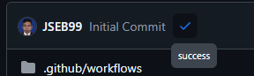

Nos llevara al actions, donde si damos en `details` podremos ver la ejecución de los pasos realizados en actions de acuerdo al `yaml` que configuramos.

### Jobs & Steps

> En la pestana `Actions` en GitHub podremos ver el historial

Dentro en un workflow podremos tener **multiples jobs**, entonces en el anterior añadiremos los siguiente

```yml
name: Hola mundo

on: [push] # Se ejecute cuando hago push

jobs:
  hola: #Nombre representativo
    runs-on: ubuntu-latest # SO de ejecución

    steps:
    - name: Hola Mundo 
      run: echo "Hola Mundo"

  other:
    runs-on: ubuntu-latest
    steps:
    - name: LS
      run: ls -al
```

Si seleccionamos la acción en la pestaña `Actions` veremos lo siguiente:

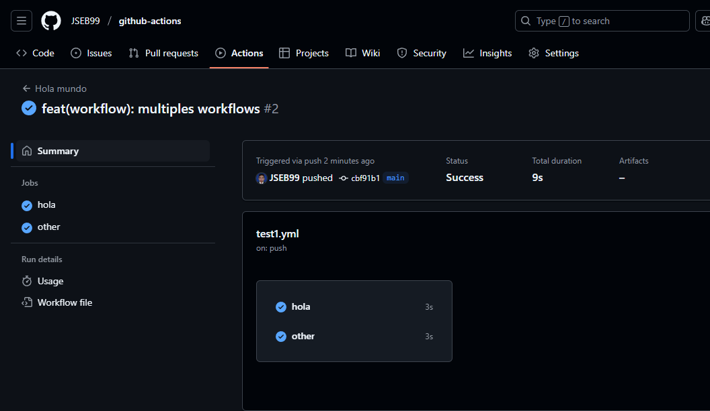

Donde podremos ver que hace cada job seleccionandolo en la pestaña de la izquierda, ahora procederemos a realizar mas acciones:

```yml
name: Hola mundo

on: [push] # Se ejecute cuando hago push

jobs:
  hola: #Nombre representativo
    runs-on: ubuntu-latest # SO de ejecución

    steps:
    - name: Hola Mundo 
      run: echo "Hola Mundo"

    - name: Touch file
      run: touch hola.txt

    - name: Set text
      run : echo "Hola Mundo" >> hola.txt

    - name: Read file
      run: cat hola.txt
  
  other:
    runs-on: ubuntu-latest
    steps:
    - name: LS 
      run: ls -al
```

Donde añadimos la creación de un archivo, envío de texto al archivo y lectura del archivo. *Entonces subimos al repositorio...* y veremos lo siguiente:

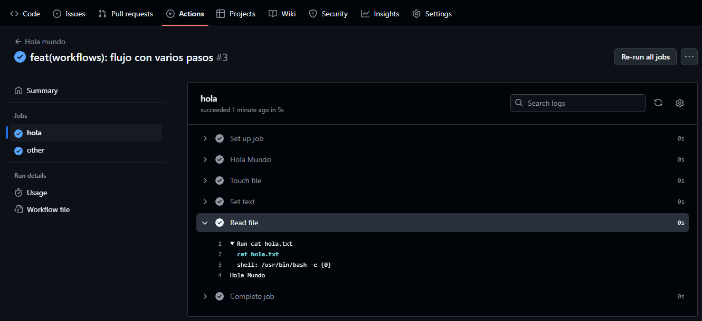

> **Nota**: los jobs se ejecutan de manera independiente y paralela, *se pueden generar dependencias para que un job se ejecute despues de otro*

**Generando dependencia**

En el job other agregaremos lo siguiente:

```yml
  other:
    runs-on: ubuntu-latest
    needs: hola # dependencia del job hola, tambien se puede definir asi [hola]
    steps:
    - name: LS
      run: ls -al
```

Por lo que ahora el esquema sería de la siguiente manera:

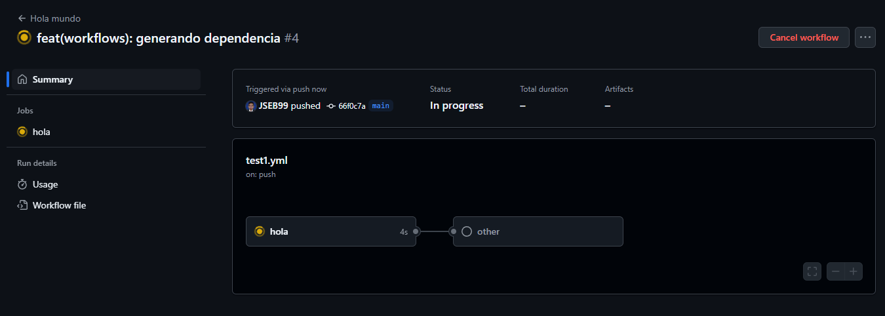

> **Aviso** aparece cargandose porque aun no terminaba de ejecutarse

### Eventos

Los eventos serán los disparadores *(Triggers)* que van a darle **indicación para ejecutar el workflow**, en el anterior ejemplo usamos el evento `Push`, es decir, que el disparador será cada que se realice un push al repositorio. [Documentación eventos](https://docs.github.com/es/actions/writing-workflows/choosing-when-your-workflow-runs/events-that-trigger-workflows)

Entonces realizamos lo siguiente:
1. nueva rama `pr`
2. nuevo archivo
3. push a la rama
4. pr

Luego si queremos hacer que esto sea de disparador le pondremos `pull_request` de la siguiente forma:

```yml
on: [push, pull_request] # Funciona con ambos
```

Actualizando la página de la pr donde estabamos, tendremos lo siguiente:

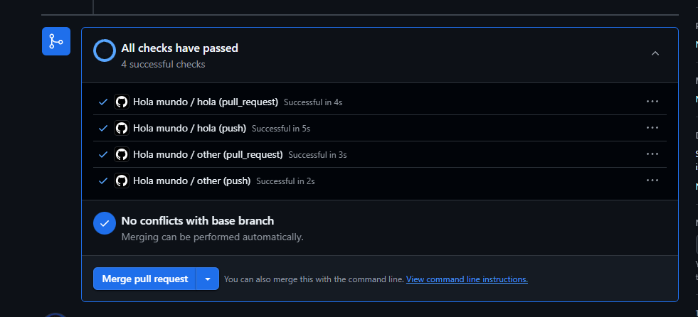

Donde vemos que se ejecuto el workflow que teniamos programado en el archivo `yaml`.

**¿Cómo hago para que el disparador sea de acuerdo a una rama?**

Tendremos que definir a que rama se le aplicará cada acción:

```yml
on:
  push:
    branches:
      - main # Puede ser una lista
  pull_request:
    branches:
      - main
```

> **Nota**: En este caso se realiza la acción debido a que se realiza un *pull request sobre la rama main*

### Actions

Bloque de código **reutilizable** que realiza una tarea en especifico en un step.

> Agrupar todos los steps que tenemos y utilizarlos en diferentes workflows

GitHub actions tambien dispone de diferentes acciones ya preestablecidas en su marketplace: [Actions marketplace](https://github.com/marketplace?type=actions)

Entonces, como ejemplo usaremos una que ya esta llamada `checkout`, para ello en el marketplace>buscamos la acción>le damos en *use latest version* y copiamos el código:

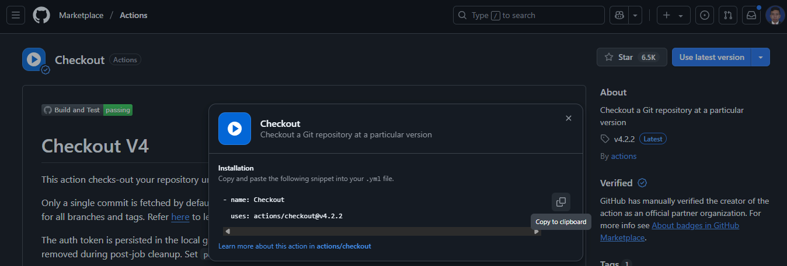

Entonces en la parte de los **steps** podremos pegar el código quedando asi:

```YML
other:
    runs-on: ubuntu-latest
    needs: hola

    steps:
    - name: Checkout
      uses: actions/checkout@v4.2.2
```

De esta manera obtenemos ubicarnos en el repositorio, de tal manera que cuando hagamos el *ls* si nos retorne los archivos del repositorio

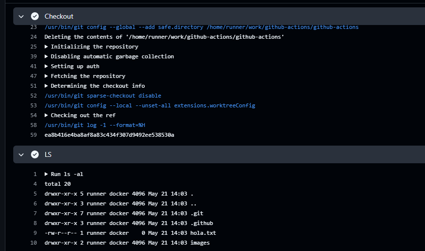

### Instalación de paquetes

A veces un problema que se puede presentar es el uso de scripts multilinea, para ello podemos usar `|` para generar un string multilinea

```yml
name: Test

on: [push]

jobs:
  test-build:
    runs-on: ubuntu-latest

    steps:
      - name: ls
        run: |
          echo "Hola Mundo" >> hola.txt
          cat hola.txt
```

Entonces cuando hacemos push subimos todo lo agregado al repositorio, de esta manera si generamos scripts en el repositorio podremos usarlos con el workflow

```sh
sudo apt-get update

sudo apt-get install curl
```

Para poder acceder a ese script, primero usaremos `checkout` para poder ver el repositorio y posteriormente usar el script, entonces le daremos permisos de ejecución y procederemos a invocarlo.

```yml
name: Test

on: 
  push:

jobs:
  test-build:
    runs-on: ubuntu-latest

    steps:
      - name: Checkout
        uses: actions/checkout@v4.2.2
      - name: ls
        run: |
          chmod +x script.sh
          ./script.sh
```

Agregando la bandera `-y` a la instalación del curl para aceptar todos los paquetes que se instalan

```sh
sudo apt-get install curl -y
```

### Uso de Actions

Poder configurar nuestro entorno, ejemplo tendremos que instalar node. **Idealmente,** se debería buscar en el marketplace si ya esta esa acción. Entonces, la buscamos [node environment](https://github.com/marketplace/actions/setup-node-js-environment) y procedemos a usarla

```yml
name: Hola mundo

on:
  push:
    branches:
      - main
  pull_request:
    branches:
      - main

jobs:
  hola: #Nombre representativo
    runs-on: ubuntu-latest # SO de ejecución

    steps:
    - name: Hola Mundo 
      run: echo "Hola Mundo"

    - name: Touch file
      run: touch hola.txt

    - name: Set text
      run : echo "Hola Mundo" >> hola.txt

    - name: Read file
      run: cat hola.txt
  
  other:
    runs-on: ubuntu-latest

    steps:
    - name: Checkout
      uses: actions/checkout@v4.2.2
    - name: LS 
      run: ls -al
    - name: Setup Node.js environment
      uses: actions/setup-node@v4.4.0
    - name: node version
      run: node --version
```

Agregamos node y revisamos si se instalo mediante `node --version`, ademas mediante los pasos podemos agregar un atributo `with` que nos permitira **enviarle parametros** al comando, entonces añadiremos lo siguiente al step del ambiente

```yml
    - name: Setup Node.js environment
      uses: actions/setup-node@v4.4.0
      with:
        node-version: latest
    - name: node version
      run: node --version
    # instalando dependencias
    - name: instalar dependencias
      run: npm install
```

> **Advertencia:** node necesita el *package.json* por lo que da error.

Donde le especificamos que queremos la ultima versión de node, ademas ya con *node instalado* procedemos a instalar la dependencia de **npm**. Ahora procederemos a instalar `php` por ejemplo, para ello agregamos lo siguiente al final

```yml
    - name: PHP
      uses: shivammathur/setup-php@v2
      with:
        php-version: '8.3'
    - name: php version
      run: php --version
```

### Actions Reutilizar

Pero como puedo yo utilizar estos bloques de código personalizados, para ello crearemos una carpeta en `.github` crearemos una carpeta llamada `actions` y dentro podemos tener subcarpetas de las acciones y cada una tendra su archivo `yml` Quedando algo asi `.github/actions/my-action/action.yml`, ya en nuestra acción tendremos lo siguiente

```yml
name: "My action"
desciption: "Test my action"

runs:
  using: "composite" # acciones de tipo composite permiten agrupar pasos comunes

  steps:
    - name: Hola Mundo
      run: echo "Hola Mundo"
      shell: bash
```

**importante** usar la directiva `shell: bash` para poder ejecutar acciones de tipo `composite`.

> La acción de tipo composite nos permitira agrupar y reutilizar neustras acciones

Para poder usarla iremos a nuestro yml del workflow quedando de la siguiente manera:

```yml
name: Test

on:
  push:

jobs:
  test-build:
    runs-on: ubuntu-latest

    steps:
      - name: Checkout code
        uses: actions/checkout@v4.2.2

      - name: ls
        uses: ./.github/actions/my-action
```

> No es necesario pasarle el archivo ya que el por defecto lo va a buscar

### Parámetros

Como vimos podemos pasarle parametros a la acción, esto se puede hacer tambien con los compostie personalizados, para ello iremos a la acción, donde definiremos la directiva que se llama inputs, le definimos el nombre del parametro *(podemos definir que hace, valores que lleva, etc)*.

Para poder acceder a ellas en el step nos apoyamos en los contextos, **para ello accedemos directamente a los inputs y de ahí al apartado que queramos**

```yml
name: "My action"
desciption: "Test my action"

inputs:
  message:
    description: "The message to print"
    required: true
    default: "Hola" # Valor por defectos

runs:
  using: "composite" # acciones de tipo composite permiten agrupar pasos comunes

  steps:
    - name: Hola Mundo
      run: echo "Hola ${{ inputs.message }}"
      shell: bash
```

En cuanto al workflow, le pasaremos el nombre de la variable con el mensaje

```yml
name: Test

on:
  push:

jobs:
  test-build:
    runs-on: ubuntu-latest

    steps:
      - name: Checkout code
        uses: actions/checkout@v4.2.2

      - name: ls
        uses: ./.github/actions/my-action
        with:
          message: "SebDev"
```

### Servicios

De vez en cuando necesitamos instalar servicios para que se ejecute de manera correcta, tales como, *MySQL, Redis, etc*. Para ese tipo de casos, se nos permite utilizar contenedores de `Docker`. Entonces en nuestro workflow

```yml
name: Ejemplo de Composite action

on: [push]

jobs:
  say-hello:
    runs-on: ubuntu-latest

    services:
      mysql: # Nombre de servicio
        image: mysql:5.7 # imagen de mysql (dockerhub)
        env: # Ambiente
          MYSQL_ROOT_PASSWORD: example
        ports:
          - 3306:3306
    # Definir steps sino arroja ERROR
    steps:
      - name: Test
        run: pwd
```

> **Advertencia**: Definir los steps para que no arroje error

Generando mas servicios...

```yml
name: Ejemplo de Composite action

on: [push]

jobs:
  say-hello:
    runs-on: ubuntu-latest

    services:
      mysql: # Nombre de servicio
        image: mysql:5.7 # imagen de mysql (dockerhub)
        env: # Ambiente
          MYSQL_ROOT_PASSWORD: example
        ports:
          - 3306:3306
      redis:
        image: redis
        ports:
          - 6379:6379
    # Definir steps sino arroja ERROR
    steps:
      - name: Test
        run: pwd
```

## Módulo 3 - Variables y Secretos

[Documentación de contextos](https://docs.github.com/es/actions/writing-workflows/choosing-what-your-workflow-does/accessing-contextual-information-about-workflow-runs)

### Variables

La forma mas común y utilizada de definir una variable es a traves de `jobs`, con el fin de cada uno de los *steps* tenga acceso a dichas variables. Para empezar definimos un `env` y dentro las variables.

```yml
name: Variables y Secretos

on: [push]

jobs:
  say-hello:
    runs-on: ubuntu-latest

    env:
      MY_VAR: Mi variable de entorno

    steps:
      - name: Test
        run: echo "Valor: $MY_VAR"
```

Donde podemos apreciar que la usamos directamente en un step, **debido a que estas se inyectan directamente en el servidor**. Ademas, tambien podemos hacerlo a nivel del step:

```yml
name: Variables y Secretos

on: [push]

jobs:
  say-hello:
    runs-on: ubuntu-latest

    env:
      MY_VAR: SIUU

    steps:
      - name: Test
      # A nivel del step
        env:
          STEP_MY_VAR: GOAT
        run: echo "EL $STEP_MY_VAR $MY_VAR!!!"
```

> Las variables de entorno cuando se ejecutan con run no llevan llaves, **y se usan solo para expresiones de GitHub Actions**.

Ademas existe una forma de hacerlo mediante la plataforma de GitHub, dirigiendote a `repo settings>secrets and variables>actions>variables>new repository variable` te permite crear una variable definiendo su nombre y valor:

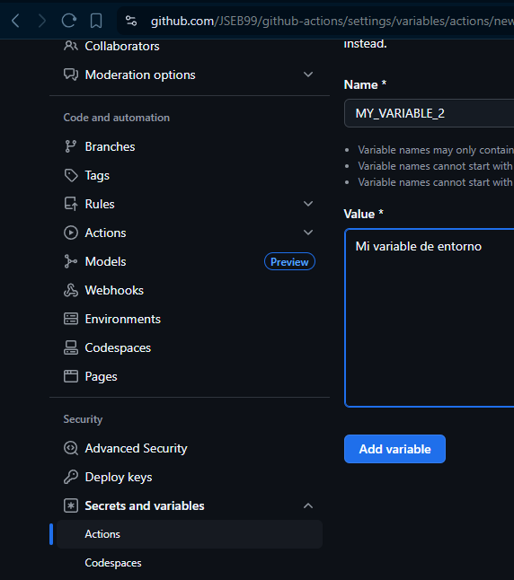

**¿Cómo podremos utilizarla?**

> **Contextos:** manera de obtener cierta información de todos los objetos que tenemos a disponición *(jobs, envs, var, etc)*

Para poder acceder a las variables de entorno definidas en el repositorio necesitaremos usar el objeto `vars` seguido de *el nombre de la variable*. Modificando el yml quedaria asi:

```yml
name: Variables y Secretos

on: [push]

jobs:
  say-hello:
    runs-on: ubuntu-latest

    env:
      MY_VAR: SIUU

    steps:
      - name: Test
        env:
          STEP_MY_VAR: GOAT
        run: |
          echo "EL $STEP_MY_VAR $MY_VAR!!!"
          echo "Variable en GitHub ${{ vars.MY_VARIABLE_2 }}"
```

> **Ojo:** vars.MY_VARIABLE_2 y que esta vez si tenemos que usar las **llaves**

A nivel repositorio permitira que se tenga acceso desde todos los workflows.

### Secretos

Son hechos para guardar información sensible, estos se pueden encontrar en la misma ubicación de las variables de entorno en GitHub Actions:

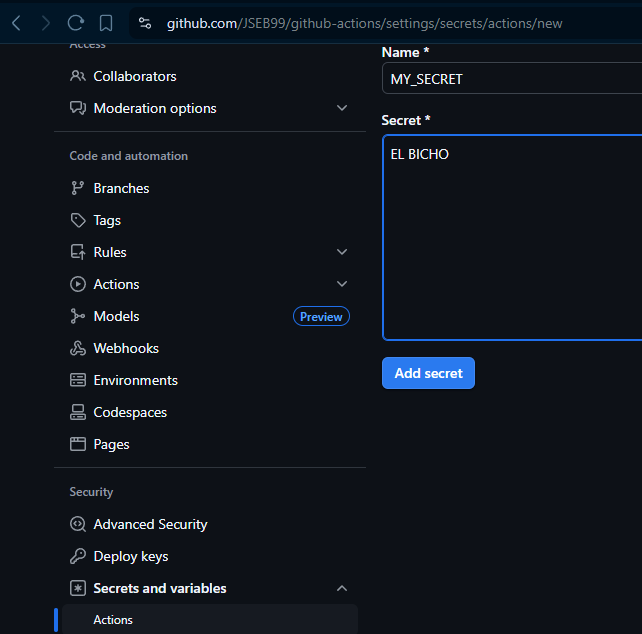

> **Advertencia:** una vez creado no podras verlo de nuevo. *Pero si puedes actualizarlo*

```yml
name: Variables y Secretos

on: [push]

jobs:
  say-hello:
    runs-on: ubuntu-latest

    env:
      MY_VAR: SIUU

    steps:
      - name: Test
        env:
          STEP_MY_VAR: GOAT
        run: |
          echo "EL $STEP_MY_VAR $MY_VAR!!!"
          echo "Variable en GitHub ${{ vars.MY_VARIABLE_2 }}"
      
      - name: Secret
        run: echo "Secret ${{ secrets.MY_SECRET }}"
```

Notar que cuando los previsualizamos nos lo muestra asi, al ser secretos:

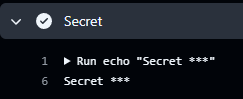

### SSH como Secretos

Valores secretos que nos permitira que no sean expuestos nuestros datos, generando la ssh key

```sh
ssh-keygen -t ed25519 -C "gh-actions" -f gh_actions_key
```

> Se usa la que no tiene la extensión `.pub` ya que esa es la clave pública, una vez generada se pone en GitHub actions igual que con los secretos

Ahora para el workflow quedaria de la siguiente manera:

```yml
name: Variables y Secretos

on: [push]

jobs:
  say-hello:
    runs-on: ubuntu-latest

    env:
      MY_VAR: SIUU

    steps:
      - name: Test
        env:
          STEP_MY_VAR: GOAT
        run: |
          echo "EL $STEP_MY_VAR $MY_VAR!!!"
          echo "Variable en GitHub ${{ vars.MY_VARIABLE_2 }}"
      
      - name: Secret
        run: echo "Secret ${{ secrets.MY_SECRET }}"

      - name: SSH
        run: |
          mkdir -p ~/.ssh
          echo "${{ secrets.SSH_KEY }}" >> ~/.ssh/id_rsa 
          chmod 600 ~/.ssh/id_rsa
          ssh-keyscan -H 127.0.1.1 >> ~/.ssh/known_hosts
          cat ~/.ssh/known_hosts
```

Cuando trabajamos con secretos debemos dar un **formateo**, es decir dentro del servidor generar un directorio `.ssh` que es donde se ubican estos archivos. Luego enviamos la información a un archivo llamado `id_rsa` que es el archivo por defecto que revisa en el servidor. *cambiamos permisos para poder usar el archivo*. Aun con eso nos daria un error, ya que debemos aprobar la conexión al servidor, para ello usamos lo siguiente `ssh-keyscan -H ip_server`, donde la ip tambien puede ser un valor secreto donde se redirige ese valor a `~/.ssh/known_hosts`.

En el caso de **no tener el servidor**, se podria usar `ssh root@ip_server` nos daría un prompt para decir si queremos conectarnos al servidor.

## Módulo 4 - Building workflows for CI/CD

### Instalar Paquetes

ejemplo de aplicativo en un proyecto *(proyecto en laravel)*

```yml
name: laravel project

on: [push]

jobs:
  laravel-test:
    runs-on: ubuntu-latest

    services:
      mysql:
        image: mysql:8.0
        ports:
          - 3006:3006
        env:
          MYSQL_ROOT_PASSWORD: root
          MYSQL_DATABASE: laravel
    steps:
      - name: Checkout
        uses: actions/checkout@v3

      - name: Set Up
        uses: shivammathur/setup-php@v2
        with:
          php-version: 8.2
          extensions: mbstring, bcmath, pdo, pd_mysql

      - name: Install Packages
      # Evitar interacción y se ejecute automaticamente
        run: composer install --no-interaction
```

### Ejecutar Pruebas

Configurando el proyecto para funcionar de forma optima

```yml
name: laravel project

on: [push]

jobs:
  laravel-test:
    runs-on: ubuntu-latest

    services:
      mysql:
        image: mysql:8.0
        ports:
          - 3006:3006
        env:
          MYSQL_ROOT_PASSWORD: root
          MYSQL_DATABASE: laravel
    steps:
      - name: Checkout
        uses: actions/checkout@v3

      - name: Set Up
        uses: shivammathur/setup-php@v2
        with:
          php-version: 8.2
          extensions: mbstring, bcmath, pdo, pd_mysql

      - name: Install Packages
      # Evitar interacción y se ejecute automaticamente
        run: composer install --no-interaction

      - name: Set App
      # Manejo de las variables de entorno
        run: cp .env-example .env

      - name: Set Key
        run: php artisan key:generate

      - name: Run Tests
        run: vendor/bin/phpunit
```

Para ello se hace una copia del `.env-example` al archivo `.env`, donde trae una variable llamada `APP_KEY` que es un hash que laravel utiliza para ciertas cuestiones, entonces necesitamos configurar esta variable. Con esto ya se podría ejecutar la aplicación de laravel. 

Para los tests se puede hacer ir a la siguiente ubicación `vendor/bin/phpunit` y ejecutar los tests por defecto.

### Condicionales

Añadiendo esto al final, donde verificamos con ayuda de los contextos si se ejecuto de manera satisfactorio el test

```yml
      - name: Deploy
        if: steps.test.outcome == 'success'
        run: ls
```

### Debug

```yml
      - name: Artifact
        uses: actions/upload-artifact@v3
        with:
          name: artifacts
          path: composer.json
```

Esto generará un archivo en el resumen de actions, donde tambien lo podremos descargar. Ya con el archivo podremos hacer lo siguiente, *cambiar el path directamente al .log* o si queremos generar multiples archivos:

```yml
      - name: Artifact
        uses: actions/upload-artifact@v3
        with:
          name: artifacts
          path: |
            composer.json
            storage/logs/laravel.log
```

> Artifacts bastante utiles a la hora de debuggear, ya que los errores no suelen ser tan verbosos. Se pueden usar cuando un step previo haya fallado

Asi como en la siguiente sentencia, donde usamos la función `failure()`

```yml
      - name: Run Tests
        id: test
        run: vendor/bin/phpunit

      - name: Artifact
        uses: actions/upload-artifact@v3
        if: failure()
        with:
          name: artifacts
          path: |
            composer.json
```

## Módulo 5 - Workflow Runners

### Runners

> La directiva `runs-on` siempre tiene que estar, *los jobs se ejecutan independientemente dentro de un servidor*

Lo único que se tiene que hacer para seleccionar un sistema operativo u otro, es mediante el comando runs-on.

### Self Hosted Runner

Algunas veces los servidores que se tienen no soportan lo suficiente, por lo que se nos permite traer nuestros propios servidores. Para ello vamos a `settings>actions>runners>new self hosted runner` y seguir las indicaciones que nos recomienda *GitHub Actions*. y cambiar el valor del `runs-on` a `self-hosted`. Una vez subido ya con el servidor en escucha, procederá a correr el job.

## Módulo 6 - Despliegues

### Autenticación por SSH

1. Generar llaves SSH
2. Copiar la llave pública en *el servidor*, para que exista una conexión
3. En GitHub Actions, crear un secreto *(ssh)*
4.  

  ```yml 
  run: |
    mkdir -p ~/.ssh
    echo "${{ secrets.KEY_SERVER }}" >> ~/.ssh/id_rsa
    chmod 600 ~/.ssh/id_rsa
    sshkeyscan -H ip_server >> ~/.ssh/known_hosts
  ```

5. Generar un step nuevo, y ubicar `ssh servidor "ls -al"` que listara varios directorios, entonces probando en el actions nos mostrará lo mismo anteriormente

### Deploy al Servidor *(Básico)*

> Dependera del lenguaje, framework, app, etc que estemos usando

Ejemplo de aplicación

```yml
name: deployment

on: [push]

jobs:
  local-action:
    runs-on: ubuntu-latest

    steps:
      - name: Set Up
        run:  |
          mkdir -p ~/.ssh
          echo "${{ secrets.KEY_SERVER }}" >> ~/.ssh/id_rsa
          chmod 600 ~/.ssh/id_rsa
          sshkeyscan -H ip_address >> ~/.ssh/known_hosts 
      
      - name: ls ssh
        run: ssh azureuser@ip_address "ls -al"

      - name: executing remote ssh commands using password
        uses: appleboy/ssh-action@v1.0.3
        if: success()
        with:
          host: ip_address
          username: username
          key: ${{ secrets.PASSWORD }}
          port: ${{ secrets.port }}
          script: |
            cd workpath
            git pull origin main
```

### Matrix

La estrategia de tipo matrix, **permite ejecutar un job varias veces con varias especificaciones.** Para poder usar se debe ir al apartado jobs:

```yml
jobs:
  example_matrix:
    strategy:
      matrix:
        version: [10, 12, 14]
        os: [ubuntu-latest, windows-latest]
```

Ejemplo:

```yml
name: Test Composite Action

on: [push]

jobs:
  local-action:
    runs-on: ubuntu-latest

    strategy:
      matrix:
        php-version: [7.4, 8.0, 8.1]
    
    steps:
      - name: Checkout
        uses: actions/checkout@v3
      
      - name: Set Up PHP
        uses: shivammathur/setup-php@v2
        with:
          php-version: ${{ matrix.php-version }}
      
      - name: Run Script
        run: |
          echo "PHP version ${{ matrix.php-version }}"
          php -v
```

Entonces lo ejecutará 3 veces, cada uno por cada versión, donde mediante los contextos podemos acceder a los valores de la matriz. Viendose de esta manera en GitHub Actions

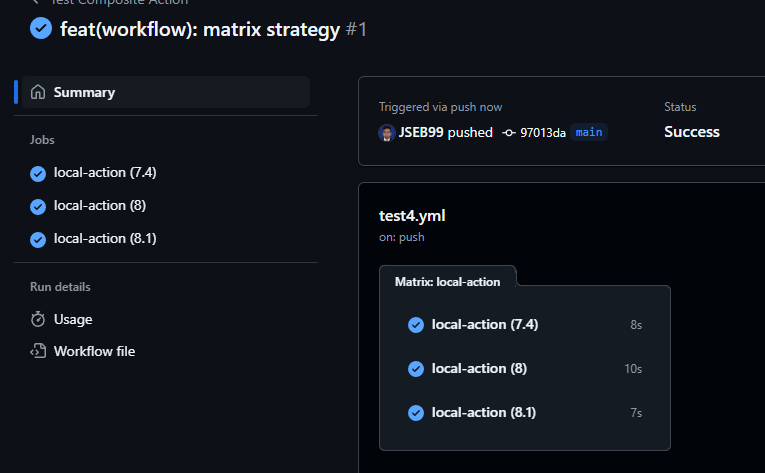

Permitiendo asi probar en diferentes entornos los aplicativos.

## Módulo 7 - Monitoreo y Notificaciones

Diferentes acciones que nos permiten conectarnos a diferentes servicios

### Slack

**Generar un webhook** para poder enviar nuestros mensajes y que se vean reflejados en el chat

En Slack:

1. Canal de slack
2. Tools & Settings
3. Manage apps
4. Buscar Webhook *(incoming webhook)*
5. Add to slack
6. En que canal lo queremos utilizar
7. Add incoming WebHooks integration *(Genera una URL)*
8. Copiar la URL

En el repositorio de GitHub:

1. Settings
2. Actions
3. Secrets
4. Generar un secreto con la **URL copiada**
5. En el workflow agregar lo siguiente:

```yml
name: Test WebHook

on: [push]

jobs:
  local-action:
    runs-on: ubuntu-latest
    
    steps:
      - name: Checkout
        uses: actions/checkout@v3
      
      - name: Notification
      # Usando una action preestablecida
        uses: rtCamp/action-slack-notify@v2.1.1
        env:
          SLACK_WEBHOOK: ${{ secrets.WEBHOOK_URL }}
        with:
          author_name: "Action"
          fields: repo, message, commit, author, action, eventName
```

[Acción utilizada](https://github.com/rtCamp/action-slack-notify)


### Condicionales

El uso de `id` para nombrar los steps y de esta manera poder acceder a ellos mediante contextos

```yml
name: Test WebHook

on: [push]

jobs:
  local-action:
    runs-on: ubuntu-latest
    
    steps:
      - name: Checkout
        id: checkout # dando id unico
        uses: actions/checkout@v3
      
      - name: Notification
      # Usando una action preestablecida
        uses: rtCamp/action-slack-notify@v2.1.1
        if: steps.checkout.outcome == 'success'
        # reviso si el step checkout fue satisfactorio
        env:
          SLACK_WEBHOOK: ${{ secrets.WEBHOOK_URL }}
        with:
          author_name: "Action"
          fields: repo, message, commit, author, action, eventName
```

### Workflow Dispatch

Evento de GitHub Actions que nos sirve para poder ejecutar de **forma manual** nuestro workflow, normalmente cuando hacemos el push este se ejecuta automaticamente en GitHub Actions. Sin embargo, en ciertas situaciones queremos tener mas control sobre cuando ejecutar las tareas. Con el `workflow dispatch` nos va a permitir controlar cuando ejecutamos nuestro *workflow*. **Habilita un boton en el panel de actions para ejecución manual**. Para poder trabajar con este workflow tendremos que cambiar el evento a `on: workflow_dispatch` y listo. Entonces con el siguiente código:

```yml
name: Test5

on: workflow_dispatch

jobs:
  test-build:
    runs-on: ubuntu-latest

    steps:
      - name: CheckOut
        uses: actions/checkout@v2

      - name: ls
        run: ls -al
```
